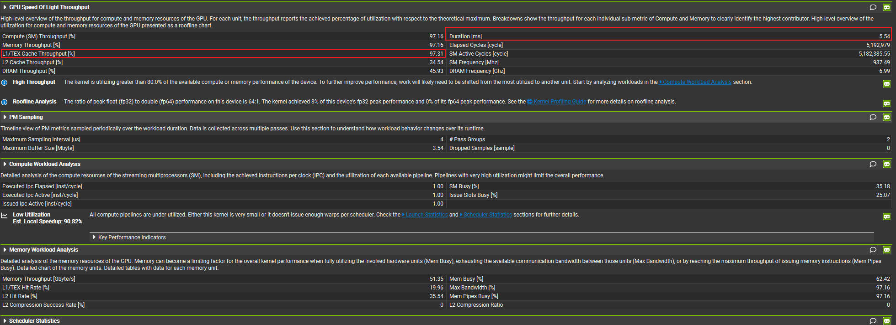
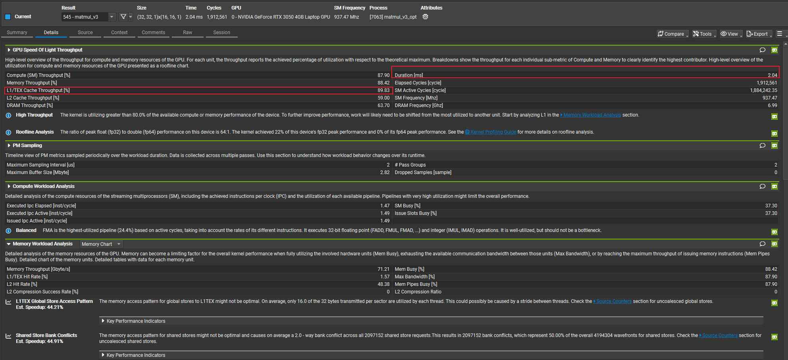

# CUDA-GEMM-Optimization-Journey

[中文](#中文) | [English](#english)

A hands-on CUDA GEMM optimization project built with a custom PyTorch CUDA extension, documenting the path from a basic kernel to a `v3` register-tiled implementation.

---

## 中文

### 项目简介

`CUDA-GEMM-Optimization-Journey` 记录了我手写 CUDA GEMM Kernel 的优化过程。这个项目不是为了复刻一个完整的 cuBLAS，而是为了系统地走一遍 GEMM Kernel 的优化路径，从能跑、能验证，到能用 Nsight 数据证明优化有效。

项目当前仓库中保留并暴露的是最终采用的 `v3` 版本 Kernel。它通过 PyTorch CUDA Extension 的方式对外提供 Python 接口，便于直接测试正确性与性能。

### 项目目标

这个项目主要关注三件事：

- 手写一个可运行的 CUDA 矩阵乘法算子
- 用 PyTorch Extension 把 CUDA Kernel 接进 Python 工作流
- 用 Nsight Compute 对比不同版本的性能表现，验证优化是否真的生效

### 优化演进：v1 -> v2 -> v3

这个项目的重点不只是结果，而是优化过程本身。

#### v1

`v1` 是最基础的朴素实现，目标是先把 CUDA GEMM 的线程映射、索引计算和结果写回流程跑通。这个阶段以正确性为主，性能不是重点。

#### v2

`v2` 开始引入更明确的 Tiling 和 Shared Memory 思路：

- 让线程块协作加载 A、B 子块
- 降低对 Global Memory 的重复访问
- 为后续更深入的数据复用优化打基础

相比 `v1`，`v2` 已经进入“真正开始做性能优化”的阶段。

#### v3

最终选择的是 `v3`，原因很明确：

> v3 采用了 Register Tiling。让一个工友负责 2x2 的矩阵，将算术访存比直接拉升，彻底击碎 L1 瓶颈。

对应到代码层面，`v3` 做了这些关键改动：

- `BLOCK_SIZE = 16`
- `THREAD_TILE = 2`
- 每个线程不再只计算 1 个输出元素，而是负责一个 `2x2` 输出子块
- 数据先进入 Shared Memory，再由线程读入寄存器完成累加
- 每个线程在寄存器中维护 `c_regs[2][2]`

这个设计的核心收益是：

- 提升单线程的数据复用率
- 提高 arithmetic intensity
- 用更多计算去摊薄访存成本
- 让性能瓶颈从“频繁喂数据”转向“更充分地消费数据”

### 当前仓库实现了什么

- `setup.py`：构建 `my_custom_gemm` PyTorch CUDA 扩展
- `binding.cpp`：通过 `pybind11` 导出 `run_v3`
- `matmul.cu`：实现 `v3` 版本 GEMM Kernel
- `test_gemm.py`：完成正确性校验与简单 benchmark

### 项目结构

```text
.
|-- binding.cpp
|-- matmul.cu
|-- setup.py
|-- test_gemm.py
|-- image/
|   |-- Matmul_v2.jpg
|   `-- Matmul_v3.jpg
`-- .gitignore
```

### 核心实现说明

`matmul.cu` 中当前保留的是 `v3` Kernel，它采用块级矩阵乘法与寄存器分块结合的思路：

1. 每个 block 负责一个输出 tile
2. A、B 子块被协作搬运到 Shared Memory
3. 每个线程维护一个 `2x2` 的寄存器累加块
4. 沿 K 维逐 tile 累加
5. 最终写回全局内存

Python 接口如下：

```python
my_custom_gemm.run_v3(a, b, c, width)
```

其中 `a`、`b`、`c` 为 CUDA Tensor，`width` 为方阵边长。

### Nsight 对比：v2 vs v3

下面这两张图是 `v2` 和 `v3` 的 Nsight Compute 截图，用来观察 `Duration` 和 `L1/TEX Cache` 相关指标的变化。

#### v2 Nsight



#### v3 Nsight



#### 关键指标对比

| Metric | v2 | v3 | 变化 |
| --- | ---: | ---: | --- |
| Duration (ms) | 5.54 | 2.04 | 缩短约 63.2% |
| Kernel speedup | 1.00x | 2.72x | v3 更快 |
| L1/TEX Cache Throughput (%) | 97.31 | 89.83 | 压力下降 7.48 个百分点 |
| fp32 Peak Performance Achieved | 8% | 22% | 计算利用率明显提升 |

#### 结果解读

从 Nsight 的结果看，`v3` 的优化效果是非常明确的：

- `Duration` 从 `5.54 ms` 降到 `2.04 ms`
- 核函数耗时减少约 `63.2%`
- 也可以等价理解成 `v3` 相比 `v2` 达到了约 `2.72x` 的加速

这组数据非常适合作为 `Register Tiling` 优化生效的核心证据。

同时，`L1/TEX Cache Throughput` 从 `97.31%` 降到了 `89.83%`。这说明：

- `v2` 中 L1/TEX 的压力非常高，已经逼近满载
- `v3` 通过让一个线程负责 `2x2` 输出块，提高了寄存器中的复用效率
- 同样规模的计算，不再像 `v2` 那样强烈依赖 L1/TEX 路径反复供数
- 结果就是缓存侧压力有所回落，而总执行时间显著缩短

换句话说，`v3` 的优化不是“只让某个指标更好看”，而是实实在在地把算子从更偏访存受限的状态，推进到了更高效的计算/访存平衡点。

从 Nsight 的 roofline 摘要来看，这一点也有侧面印证：

- `v2` 达到的设备 fp32 峰值性能约为 `8%`
- `v3` 提升到了约 `22%`

这说明 `v3` 不只是“跑得更快”，而是真正把 GPU 的计算资源调动得更充分了。

### 为什么 v3 能证明优化演进成立

如果只看代码结构，`v3` 确实更复杂；但真正让它成立的是性能证据。

`v3` 证明优化演进有效，关键在于这三点：

- 时间显著缩短：`5.54 ms -> 2.04 ms`
- L1/TEX 压力回落：说明访存瓶颈被缓解
- 计算利用率提升：说明更多数据复用转化成了真实吞吐

这正是从 `v2` 走向 `v3` 的意义所在：不是单纯“把代码写复杂”，而是通过 `Register Tiling` 把 Kernel 推到一个更成熟的优化阶段。

### 构建

建议环境：

- Python 3.10+
- PyTorch
- CUDA Toolkit
- 可用的 NVCC 编译环境

构建方式：

```bash
python setup.py build_ext --inplace
```

或者：

```bash
python setup.py install
```

### 测试

```bash
python test_gemm.py
```

测试脚本会：

- 创建 `1024 x 1024` 的 `float32` CUDA Tensor
- 调用 `torch.matmul` 与 `my_custom_gemm.run_v3`
- 比较数值正确性
- 统计平均耗时

### 当前限制

- 当前实现主要面向方阵 GEMM
- 更适合 `width` 可被 `32` 整除的场景
- 当前仅支持 `float32`
- `v1 / v2` 作为演进思路存在于文档中，但源码当前仓库只保留了 `v3`

### Roadmap：未来优化算子库

接下来的目标，不只是继续优化一个 Kernel，而是把这条路径逐步发展成一个更完整的 CUDA GEMM 优化算子库。

#### V4.0 错位存储（Padding）

目标：解决 Nsight 中已经出现的 Shared Memory Bank Conflict 警告。

- 在 Shared Memory 布局中加入 padding
- 避免线程访问同一 bank 时发生“撞车”
- 降低 shared store / shared load 的 bank conflict

一句话理解：

> 让工友拿数据不再撞车。

#### V5.0 向量化访存（Vectorized Access）

目标：进一步提升全局内存访问效率，压榨显存带宽。

- 使用 `float4` 等向量化类型进行加载与存储
- 提高单次访存的数据吞吐
- 改善 global memory access efficiency

一句话理解：

> 让工友一次性扛 4 块砖，直接把显存带宽吃干抹净。

#### V6.0 双缓冲 / 软件流水线（Double Buffering）

目标：隐藏访存延迟，让计算与搬运并行。

- 在计算当前 tile 的同时，预取下一块 tile
- 构建 load/compute overlap
- 尽量把访存等待时间藏到计算阶段背后

一句话理解：

> 算这块砖的时候，后台偷偷搬下一块砖，尽可能把访存时间隐藏掉。

#### V7.0 Tensor Core 终极优化

目标：从常规 CUDA Core 路径切入到 Tensor Core 路径，进一步提升矩阵乘法吞吐。

- 采用 WMMA / MMA 等 Tensor Core 编程方式
- 针对 `half` / `bf16` 等数据类型做专门优化
- 让 Kernel 从“优化版 CUDA Core GEMM”走向“Tensor Core GEMM”

一句话理解：

> 抛弃普通 CUDA Core，调用 Nvidia 专为矩阵打造的物理外挂。

#### 路线图总结

如果说当前的 `v3` 证明了 `Register Tiling` 已经带来了明确的性能跃迁，那么后续路线就会进一步围绕这几类瓶颈逐层击破：

- `V4.0` 解决 Shared Memory Bank Conflict
- `V5.0` 提升 Global Memory 吞吐
- `V6.0` 隐藏访存延迟
- `V7.0` 切入 Tensor Core 专用矩阵计算路径

这也意味着，这个项目未来不只是一个“手写 matmul demo”，而是一个有明确演进路线的 CUDA GEMM 优化实验场。

---

## English

### Overview

`CUDA-GEMM-Optimization-Journey` is a hands-on project that documents my CUDA GEMM kernel optimization process. The goal is not to reimplement cuBLAS, but to build a real optimization journey: from a correct kernel, to a faster kernel, to a kernel whose improvement can be validated with Nsight Compute.

The repository currently exposes the final `v3` kernel through a PyTorch CUDA extension.

### Project Goals

This repository focuses on three things:

- writing a working custom CUDA matrix multiplication kernel,
- integrating it into Python through a PyTorch extension,
- validating kernel evolution with profiler evidence.

### Optimization Journey: v1 -> v2 -> v3

#### v1

`v1` was the baseline implementation, mainly intended to establish the execution model: thread mapping, indexing, and correctness.

#### v2

`v2` introduced clearer tiling and shared-memory staging:

- cooperative loading of A and B tiles,
- reduced repeated global memory access,
- better groundwork for deeper optimization.

This was the stage where the project moved from “just works” to “actually optimizing.”

#### v3

The final choice is `v3`, because it adopts **Register Tiling**:

> In v3, one worker thread computes a 2x2 output tile, increasing arithmetic intensity and breaking through the L1 bottleneck.

At the implementation level, `v3` includes:

- `BLOCK_SIZE = 16`
- `THREAD_TILE = 2`
- each thread computes a `2x2` output fragment
- A and B tiles are staged in shared memory
- accumulations are maintained in per-thread registers

This improves the kernel because:

- each thread reuses loaded data more effectively,
- arithmetic intensity increases,
- memory cost is amortized across more computation,
- the kernel reaches a better compute/memory balance.

### What Is Implemented

- `setup.py`: builds the `my_custom_gemm` PyTorch CUDA extension
- `binding.cpp`: exports `run_v3` via `pybind11`
- `matmul.cu`: contains the `v3` kernel
- `test_gemm.py`: correctness check and simple benchmark

### Project Structure

```text
.
|-- binding.cpp
|-- matmul.cu
|-- setup.py
|-- test_gemm.py
|-- image/
|   |-- Matmul_v2.jpg
|   `-- Matmul_v3.jpg
`-- .gitignore
```

### Kernel Notes

The retained `v3` implementation in `matmul.cu` follows a tiled GEMM structure:

1. each block computes one output tile,
2. A and B sub-tiles are loaded into shared memory,
3. each thread accumulates a `2x2` result tile in registers,
4. the kernel iterates across K tiles,
5. results are written back to global memory.

Python API:

```python
my_custom_gemm.run_v3(a, b, c, width)
```

### Nsight Comparison: v2 vs v3

#### v2 Nsight


#### v3 Nsight


#### Key Metrics

| Metric | v2 | v3 | Change |
| --- | ---: | ---: | --- |
| Duration (ms) | 5.54 | 2.04 | about 63.2% shorter |
| Kernel speedup | 1.00x | 2.72x | faster in v3 |
| L1/TEX Cache Throughput (%) | 97.31 | 89.83 | down by 7.48 pts |
| fp32 Peak Performance Achieved | 8% | 22% | significantly higher |

#### Interpretation

The Nsight data shows a clear optimization win for `v3`:

- kernel duration drops from `5.54 ms` to `2.04 ms`
- that is about a `63.2%` reduction in runtime
- equivalently, `v3` delivers roughly `2.72x` speedup over `v2`

This is strong evidence that register tiling is not just a structural change, but a meaningful performance improvement.

At the same time, `L1/TEX Cache Throughput` drops from `97.31%` to `89.83%`, which suggests:

- `v2` was pushing the L1/TEX path extremely hard,
- `v3` improves in-register reuse by assigning each thread a `2x2` output tile,
- the kernel depends less aggressively on L1/TEX to feed computation,
- overall runtime improves substantially as a result.

The roofline summary supports the same conclusion:

- `v2` achieves about `8%` of device fp32 peak performance,
- `v3` reaches about `22%`.

So `v3` is not only faster, but also better at converting available GPU resources into useful compute throughput.

### Build

Recommended environment:

- Python 3.10+
- PyTorch
- CUDA Toolkit
- a working NVCC toolchain

Build in place:

```bash
python setup.py build_ext --inplace
```

Or install:

```bash
python setup.py install
```

### Test

```bash
python test_gemm.py
```

The script:

- creates `1024 x 1024` CUDA `float32` matrices,
- compares `torch.matmul` with `my_custom_gemm.run_v3`,
- checks numerical correctness,
- reports average runtime.

### Current Limitations

- mainly targets square GEMM
- best suited for dimensions divisible by `32`
- currently supports `float32` only
- `v1 / v2` are documented as evolution stages, while the repo currently keeps only `v3` source code

### Roadmap: Toward a Larger Optimized Kernel Library

The next step is not just to keep tuning one kernel, but to turn this optimization path into a more complete CUDA GEMM kernel roadmap.

#### V4.0 Padding

Goal: eliminate the shared-memory bank conflict warning already visible in Nsight.

- add padding to shared-memory tile layout
- reduce bank conflicts during shared memory access
- improve shared load/store behavior

In plain words:

> make workers stop colliding when they fetch data.

#### V5.0 Vectorized Access

Goal: improve global memory throughput and push bandwidth utilization higher.

- use vectorized types such as `float4`
- move more data per memory transaction
- improve global memory access efficiency

In plain words:

> let one worker carry four bricks at once and squeeze more out of memory bandwidth.

#### V6.0 Double Buffering / Software Pipelining

Goal: overlap memory movement with computation.

- prefetch the next tile while computing the current one
- build compute/load overlap
- hide memory latency behind useful work as much as possible

In plain words:

> while workers are processing one tile, the next tile is already being moved in the background.

#### V7.0 Tensor Core Final Form

Goal: move beyond ordinary CUDA Core execution and enter the Tensor Core path for matrix math.

- adopt WMMA / MMA-style Tensor Core programming
- optimize for `half` / `bf16`
- evolve from a CUDA Core GEMM kernel into a Tensor Core GEMM kernel

In plain words:

> stop fighting with standard CUDA cores alone and call in Nvidia's matrix-specific hardware accelerator.

#### Roadmap Summary

If `v3` proves that register tiling already delivers a meaningful performance jump, then the next stages target the remaining bottlenecks one by one:

- `V4.0`: remove shared-memory bank conflicts
- `V5.0`: improve global memory throughput
- `V6.0`: hide memory latency
- `V7.0`: unlock Tensor Core acceleration

That is what turns this repository from a hand-written matmul demo into a structured CUDA GEMM optimization journey.
